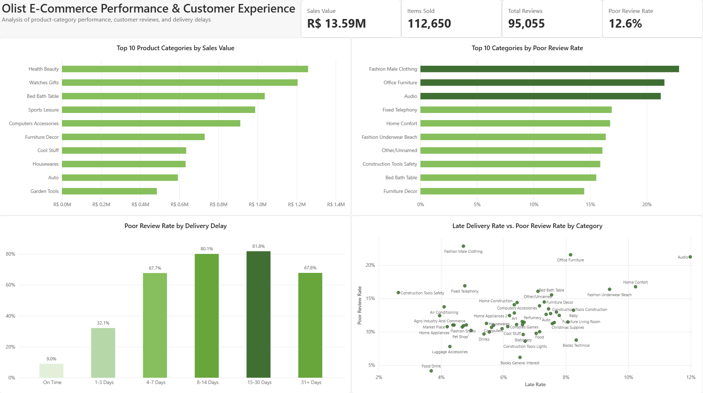

# Olist E-Commerce Performance & Customer Experience Analysis

## Project Overview

The Olist dataset contains real-world e-commerce data covering nearly 100,000 orders, including product categories, customer reviews, order fulfillment, and delivery performance. Using PostgreSQL and Power BI, I analyzed the data to identify patterns in commercial performance and customer experience and determine where potential business issues were concentrated. The analysis focuses on product-category performance, poor customer reviews, and the relationship between delivery delays and customer satisfaction, with the goal of turning these findings into actionable business insights.